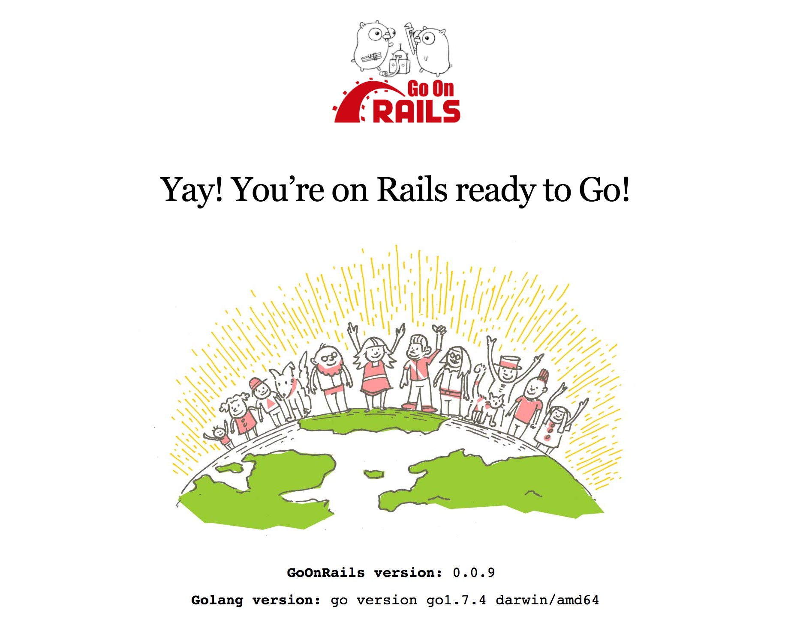

# A simple example on usage of go-on-rails generator

This is an simple example for the [go-on-rails](https://github.com/goonr/go-on-rails), a Rails generator.

You can take the example as a tutorial, too. I'll make it as simple and clear as possible to show how to use the go-on-rails generator to generate Golang codes in a Rails app.

Even though I highly recommend you to get a quick overview of [go-on-rails](https://github.com/goonr/go-on-rails) to learn some commands usage before taking further in this example.

### Environments

* macOS Sierra v10.12.4
* Ruby v2.3.3
* Rails v5.0.2
* MySQL v5.7.11
* Golang v1.7.4 darwin/amd64

### Build a Rails app

Firstly, we will follow the tutorial in Rails guides, to [build a (very) simple weblog](http://guides.rubyonrails.org/getting_started.html). We may not copy that whole steps, but the models mainly.

Let's create a new Rails app:

```bash
rails new example_simple --api --database mysql --skip-bundle
```

change to the new directory, add the gem `go-on-rails`:

```bash
# edit Gemfile
gem 'go-on-rails', '~> 0.0.9'
```
and then bundle:

```bash
bundle install
```

### Create some models

We'll build two models: article and comment. And there's a `has_many` association between them.

```bash
rails g model Article title:string text:text
```

```bash
rails g model Comment commenter:string body:text article_id:integer
```

You'd better add some restrictions to the migration files to give a limit on database level, eg. add `null: false` to the `title` column:

```ruby
# the migration file under db/migrate
class CreateArticles < ActiveRecord::Migration[5.0]
  def change
    create_table :articles do |t|
      t.string :title, null: false
      t.text :text

      t.timestamps
    end
  end
end
```

And meanwhile we add some presence and length validations to the models:

```ruby
# app/models/article.rb
class Article < ApplicationRecord
  has_many :comments, dependent: :destroy

  validates :title, presence: true, length: { in: 10..30 }
  validates :text, presence: true, length: { minimum: 20 }
end

# app/models/comment.rb
class Comment < ApplicationRecord
  belongs_to :article

  validates :commenter, presence: true
  validates :body, presence: true, length: { minimum: 20 }
end
```

Then run the migration:

```bash
rails db:migrate
```

### Generate Golang codes

Now it's time to show magic!

Run the command:

```bash
rails g gor dev
```
and a new directory named `go_app` with some files will be created under the root of Rails app:

```
# directory structure of go_app

├── controllers
│   └── home_controller.go
├── main.go
├── models
│   ├── db.go
│   ├── gor_article.go
│   └── gor_comment.go
├── public
│   └── favicon.ico
└── views
    └── index.tmpl
```

then let's install Golang dependancies(some packages) we'll use:

```bash
rails gor:deps
```

when the installation completed after some while, make sure you now under the root of `go_app` and run:

```bash
go run main.go
```

open http://localhost:3000 by default in your browser, you can see a  welcome page from go-on-rails:



## What on earth be generated?

#### public

The dir serves the static assets. You can create new directories or files under `public`, or you can create any other directories under the `go_app`, and then set the routes for serve the file system. [How to set it]()

#### models

* Each file here heading with `gor_` corresponding to each model we created by the `rails g model` command above, all functions are mostly for database CRUD manipulations, and also some basic validations and associated operations
* You can create new `.go` files to add more functions for the models under the `models` directory using the package name `model`
* Run the command `godoc .` under models directory to show all available model functions and methods

#### controllers

* Under the `controllers` dir we create handlers for the HTTP routes we set in the `main.go` file, we call them `controller` by the Rails convention
* For the structure clearity we create one controller file corresponding to each model like Rails does, too

#### views

* yes, you can put all the template files here
* Because we choose the Gin HTTP framework, we can load all the templates in at initial time [How to set]()

## Let's go on our example

In this simple example we just build APIs interacting with data in JSON format.

#### Create some customed controllers

* We create `articles_controller.go` and `comments_controller.go` for each model. Each function to a RESTful action.
* Import `model` package to use avaliable functions and methods we have generated

#### Add routes for the controller functions

In the `main.go` add some routes to map the HTTP requests to the right handlers we created in the controller files.

```go
// for the articles
r.GET("/", c.HomeHandler)
r.GET("/articles", c.ArticlesIndex)
r.POST("/articles", c.ArticlesCreate)
r.GET("/articles/:id", c.ArticlesShow)
r.DELETE("/articles/:id", c.ArticlesDestroy)
r.PUT("/articles/:id", c.ArticlesUpdate)
```

#### Testing with curl command

In a terminal window run `go run main.go`, in another terminal use `curl` command to test API we added.

For example, to get all `article` records:

```bash
curl -XGET 'http://localhost:3000/articles'
```

To create a new article, run:

```bash
curl -XPOST 'http://localhost:3000/articles' -d '{ "title": "Use go-on-rails to build a Golang app", "text": "blablabla..." }'
```

You can check the [main.go](https://github.com/goonr/example_simple/blob/master/go_app/main.go) and [controller files](https://github.com/goonr/example_simple/tree/master/go_app/controllers) in this repository for details.
